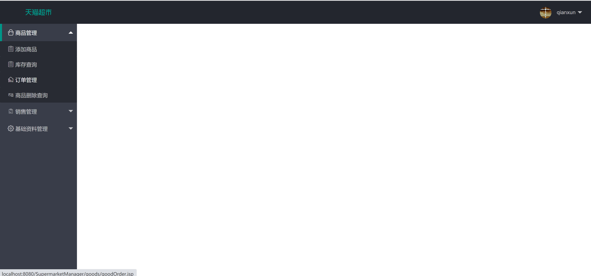
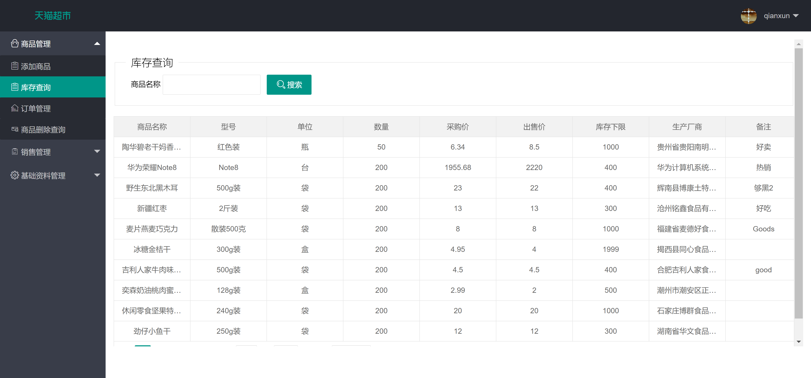
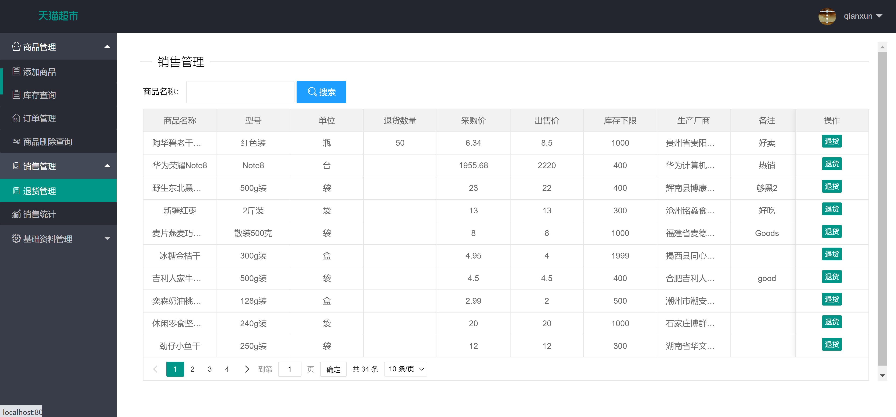
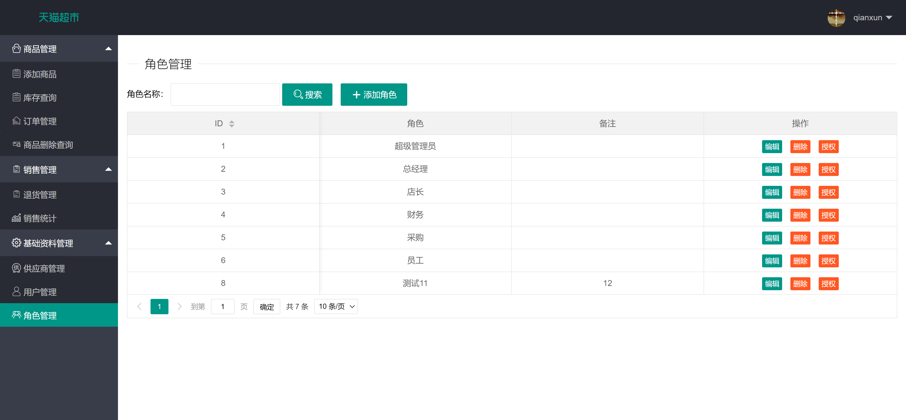

<h1 align="center">超市管理系统</h1>

## 简介
超市管理系统：角色包括超级管理员、总经理、店长；功能涵盖商品管理、订单管理、销售管理、库存查询、退货管理、角色管理。    --计算机毕业设计源码；毕设源码；java毕业设计源码

## 联系方式

<h3 align="center">获取完整代码与数据库文件 + 微信：bysj5151 QQ: 86050149 QQ群: 783742310</h3>

<h3 align="center">可帮忙远程部署 包运行成功！提供远程部署、修改代码、设计文档指导、代码讲解等服务！</h3>

## 功能介绍（完整见运行截图）
管理员：拥有系统的全面管理权限，可以进行商品管理、订单管理、销售管理、库存查询、角色管理等操作。在商品管理中，可以添加新商品、查询库存情况和执行删除查询；在订单管理中，可查看和处理订单信息；销售管理涉及查看销售数据和退货管理；角色管理中可以管理不同角色的权限和信息。基础资料管理包括系统设置和维护，确保整个系统的正常运作。

店长：负责日常的商品管理和订单处理。在商品管理模块中，店长可以添加或修改商品信息，进行库存查询，以确保货物供应充足。同时店长需要查看和处理订单，监督销售情况，执行销售数据统计分析，从而优化商品配置和店铺运营策略。具备一定权限进行员工管理，提升内部工作效率。

销售人员：主要参与销售管理和客户服务。在销售管理模块中，销售人员负责处理商品销售和退货事务，确保交易的顺利完成。同时需要熟悉库存情况，及时调整销售策略。负责与客户沟通，解答顾客疑问，提升客户体验。根据客户反馈和销售数据，与店长和其他管理人员沟通，改进销售和服务策略。

库存管理员：专注于商品库存的管理，负责定期对库存的信息进行核查和更新。在库存查询界面中，检查商品的数量、采购价、出售价以及库存下限等细节，确保库存符合需求。根据销售人员的反馈，进行库存调整和货物补充，避免因库存不足影响销售。同时负责记录和维护商品的供货商信息，确保供应链的持续运作。

## 运行截图

本代码来源于网络,仅供学习参考使用!

